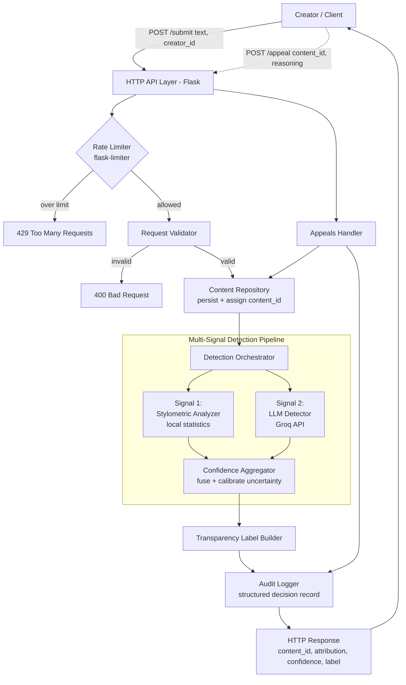

# Provenance Guard — Architecture Narrative

> **Purpose.** Provenance Guard is a platform for sharing original creative writing.
> Its job is to help readers judge whether a submitted piece was *written by a human*
> or *generated by AI and misrepresented as human work*, and to communicate that
> judgment honestly, including how *uncertain* it is.
>
> This document is the architecture narrative. It follows a single piece of text from
> the moment a creator submits it to the moment a reader sees a transparency label,
> and describes every component the text passes through along the way.

---

## 1. Design principles

These principles shape every component decision below.

1. **Never overclaim.** Attribution is probabilistic. The system reports a *confidence*,
   not a verdict, and the reader-facing label must make low confidence feel low.
2. **No single point of judgment.** Classification requires agreement across **at least
   two independent signals** computed by different methods. One signal is never enough.
3. **Every decision is auditable.** Each attribution writes a structured record inputs,
   signals, scores, and outcome that can be replayed and contested.
4. **Creators have recourse.** A creator can always contest a classification; the appeal
   is logged next to the original decision and moves the content to *under review*.
5. **Protect the endpoint.** Submission is rate-limited so the pipeline (and its paid
   LLM calls) cannot be exhausted or abused.

---

## 2. Architecture



Text always flows **forward** through the pipeline. The appeals path (dashed) is a
separate entry point that revisits an existing decision rather than creating a new one.

---

## 3. The journey of a single piece of text

One submission, start to finish:

1. **Submit.** A creator sends `POST /submit` with `text` and a `creator_id`. This is the only way text enters the system.
2. **Rate limit.** The **Rate Limiter** checks the client's budget (e.g. 10/min, 100/day). Over budget → `429`, and the text goes no further.
3. **Validate.** The **Request Validator** confirms `text` is present, is a string, and is within length bounds. Malformed input → `400`.
4. **Persist.** The **Content Repository** stores the submission and assigns a stable `content_id` (UUID) that the audit log and appeals both reference.
5. **Detect.** The **Detection Orchestrator** runs two independent signals — the **Stylometric Analyzer** (local statistics) and the **LLM Detector** (Groq) — each returning a probability `p_ai` that the text is AI-generated.
6. **Aggregate.** The **Confidence Aggregator** fuses the signals into one calibrated `p_ai`, pulling toward 0.5 when they disagree so confidence reflects real doubt.
7. **Label.** The **Transparency Label Builder** maps `p_ai` to a confidence band and a plain-language label (e.g. "Inconclusive" near 0.5 vs. "Very likely AI-generated" near 0.95).
8. **Audit.** The **Audit Logger** records the full decision: signals, scores, attribution, label, and model version.
9. **Respond.** The API returns `content_id`, `attribution`, `confidence`, and `label` — the same label readers see.
10. **Appeal** *(optional, later)*. If the creator disputes the result, `POST /appeal` logs their reasoning beside the original decision and sets status to `under_review`. No automatic reclassification.

---

## 4. Component catalog

Each component the text interacts with, and what it is responsible for.

| # | Component | Responsibility | In → Out |
|---|-----------|----------------|----------|
| 1 | **HTTP API Layer** (Flask) | Entry/exit; routing for `/submit` and `/appeal`; JSON (de)serialization | HTTP ↔ Python dicts |
| 2 | **Rate Limiter** (flask-limiter) | Throttle submissions per client; reject floods with `429` | request → allow/deny |
| 3 | **Request Validator** | Enforce payload shape & text-length bounds; reject with `400` | raw JSON → clean `(text, creator_id)` |
| 4 | **Content Repository** | Persist submissions; assign `content_id`; track status (`classified` / `under_review`) | text → stored record |
| 5 | **Detection Orchestrator** | Run the signals, collect their outputs, hand off to aggregation | text → list of signal results |
| 6 | **Signal 1 — Stylometric Analyzer** | Local statistical detection (burstiness, lexical diversity, repetition, regularity) | text → `p_ai` + reliability |
| 7 | **Signal 2 — LLM Detector** (Groq) | Semantic detection via hosted LLM; returns `p_ai` + rationale | text → `p_ai` + rationale |
| 8 | **Confidence Aggregator** | Fuse signals into one calibrated `p_ai`; widen uncertainty on disagreement | signal results → fused confidence |
| 9 | **Transparency Label Builder** | Map confidence band → plain-language reader label | `p_ai` → `(attribution, label)` |
| 10 | **Audit Logger** | Append structured, replayable decision records (incl. appeals) | decision → log entry |
| 11 | **Appeals Handler** | Capture creator reasoning, log it beside the decision, set `under_review` | `(content_id, reasoning)` → updated status + log |

> **Why two signals of different *kinds*?** Stylometry is cheap, deterministic, and
> network-free but fooled by edited or paraphrased AI text; the LLM detector is richer
> but costly, variable, and can be confidently wrong. Combining a *statistical* signal
> with a *semantic* one means each covers the other's blind spot — and their
> (dis)agreement is itself information the aggregator uses to set confidence.

---

## 5. Data model (entities the text touches)

- **Submission / Content** — `content_id`, `creator_id`, `text`, `submitted_at`, `status`.
- **Decision** — `content_id`, `decided_at`, `attribution`, `confidence`, `signals[]`
  (each: name, `p_ai`, reliability, rationale), `label`, `model_version`.
- **Appeal** — `appeal_id`, `content_id`, `creator_id`, `reasoning`, `appealed_at`,
  references the original `Decision`.

Persistence can start as a lightweight store (in-memory dict or SQLite) and harden later;
the contract above is what the rest of the system depends on, not the backing engine.

---

## 6. Uncertainty representation

We track a single probability, `p_ai` = *probability the text is AI-generated*. Confidence
is expressed by **how far `p_ai` sits from 0.5** — close to the middle means we genuinely
do not know. The aggregator fuses the two signals and, when they disagree, deliberately
pulls the result toward 0.5 so the label reflects real doubt instead of false certainty.

This directly satisfies the requirement that **0.51 and 0.95 produce distinctly different
labels** (see the band table below).

---

## 7. Transparency label design

The reader-facing label is driven by the confidence band, not the raw float:

| `p_ai` band | Attribution | Reader-facing label |
|-------------|-------------|---------------------|
| 0.00 – 0.15 | human | **Very likely human-written** |
| 0.15 – 0.35 | leans human | **Probably human-written** |
| 0.35 – 0.65 | uncertain | **Inconclusive — we can't reliably tell** |
| 0.65 – 0.85 | leans AI | **Probably AI-generated** |
| 0.85 – 1.00 | AI | **Very likely AI-generated** |

Each label may carry a one-line plain-language gloss (e.g. *"Our checks disagree, so treat
this as unverified"*) so a non-technical reader understands the confidence without seeing a
number. Boundary thresholds are configuration, not hard-coded magic, so they can be tuned.

---

## 8. Appeals workflow

1. Creator calls `POST /appeal` with `content_id` and free-text `reasoning`.
2. **Appeals Handler** validates the content exists and the appeal captures reasoning.
3. The appeal is written to the **Audit Log** alongside the original decision.
4. Content status becomes `under_review`.
5. Reclassification is **not** automatic — the item now belongs to a human review queue.

---

## 9. Anticipated edge cases

Attribution is hardest at the margins. These are specific content types this design
handles poorly — including which signal fails and which way the error goes.

- **Formal, repetition-driven poetry → false "AI".** A villanelle, pantoum, or
  refrain-based poem — or a nursery-rhyme-style piece with deliberately plain
  vocabulary — has low sentence-length variance, heavy repetition, and limited lexical
  diversity. The **Stylometric Analyzer** reads exactly those features as
  "machine-smooth" and pushes `p_ai` up, flagging skilled human craft as AI. Here the
  repetition *is* the craft, not an artifact of generation.

- **Very short submissions → unreliable score.** Flash fiction, micro-poetry, or a
  six-word story gives the statistics too little data: burstiness and lexical diversity
  over one or two sentences are noise, not signal. The heuristic can still emit a
  confident-looking number from a sample that cannot support one. The aggregator should
  widen uncertainty below a minimum length, but the underlying signal is simply weak.

- **Human draft polished by AI/grammar tools → false "AI" / mixed authorship.** A
  human-conceived piece smoothed by Grammarly or a light AI rewrite is genuinely *both*,
  yet the system must collapse it to a single `p_ai`. Stylometry flattens toward "AI" and
  the LLM may agree, so honestly-assisted writing can read as misrepresentation. The
  binary human-vs-AI frame doesn't fit this case.

- **Adversarially "humanized" AI text → false "human" (the dangerous miss).** AI output
  deliberately run through a paraphraser or "humanizer" to inject burstiness and varied
  vocabulary is built to defeat the Stylometric Analyzer's very features. This is the
  system's worst failure — AI misrepresented as human, the exact abuse Provenance Guard
  exists to catch — and detection then leans entirely on the LLM signal, which is itself
  evadable.

- **Non-native or translated English → fairness risk.** ESL or machine-translated prose
  often has flattened idiom and regular structure that both signals can misread as AI,
  systematically penalizing non-native creators. This is a fairness problem, not only an
  accuracy one.

---

## 10. Audit log schema (structured)

Every attribution and every appeal appends a record such as:

```json
{
  "event": "attribution",            // or "appeal"
  "content_id": "uuid",
  "creator_id": "string",
  "timestamp": "ISO-8601",
  "signals": [
    { "name": "stylometry", "p_ai": 0.62, "reliability": 0.7 },
    { "name": "llm_groq",  "p_ai": 0.78, "reliability": 0.6, "rationale": "…" }
  ],
  "confidence": 0.71,
  "attribution": "leans AI",
  "label": "Probably AI-generated",
  "model_version": "llama-… / stylometry-v1",
  "appeal": null                     // populated on appeal events
}
```

---

## 11. AI Tool Plan

How I'll use an AI coding tool to build the system across three implementation
milestones. For each: the **spec context** I'll paste in (so the tool generates against
*this* design, not a generic one), the **ask** (the concrete artifact to generate), and
the **verification** I'll run before trusting the output. The rule throughout: every
generated function is exercised in isolation *before* it's wired into the request path.

### Milestone 3 — Submission endpoint + first signal

- **Spec I'll provide:** Signal 1(Stylometric Analyzer) and Signal 2(LLM Detector) callout, and the Architecture diagram so the tool sees where `/submit`, the Validator, the Content Repository, and Signal 1 sit in the flow. I'll also point it at the current `app.py` skeleton so it extends the existing Flask app and flask-limiter setup rather than inventing a new one.
- **What I'll ask it to generate:** a Flask app skeleton fleshing out `/submit`
  (Request Validator → Content Repository assigning a `content_id` UUID), and the **first
  signal function**, the Stylometric Analyzer: a pure-Python `analyze(text)`
  returning `p_ai` + a reliability estimate from burstiness, lexical diversity,
  repetition, and sentence-length regularity. No external calls.
- **How I'll verify:** call the stylometry function directly on a handful of inputs
  *before* wiring it into the endpoint, a clearly machine-smooth paragraph, a varied
  human paragraph, and a very short snippet, and confirm `p_ai` moves in the expected
  direction and that short text reports low reliability. Only once the
  function behaves do I connect it to `/submit` and check the endpoint returns a real
  `content_id` and signal-driven score instead of the placeholder.

### Milestone 4 — Second signal + confidence scoring

- **Spec I'll provide:** Second detection signals, Uncertainty representation (single `p_ai`, confidence =
  distance from 0.5, disagreement pulls toward 0.5), and showing both
  signals feeding the Confidence Aggregator.
- **What I'll ask it to generate:** the **second signal function**, the LLM Detector: a
  Groq prompt that returns a calibrated `p_ai` + rationale (reading `GROQ_API_KEY` from
  env per [.env.example](.env.example)), and the **scoring logic**, i.e. the Confidence
  Aggregator that fuses the two signals into one `p_ai` and widens uncertainty toward 0.5
  when they disagree or when reliability is low.
- **What I'll check:** that scores **vary meaningfully** between clearly-AI and
  clearly-human text, run several samples of each end-to-end and confirm they land in
  separated bands rather than clustering near 0.5. Then deliberately feed disagreement
  cases (humanized AI) and confirm the aggregator pulls toward 0.5
  instead of asserting false certainty. I'll also stub the Groq call to test the
  aggregator's fusion math deterministically without burning API quota.

### Milestone 5 — Production layer

- **Spec I'll provide:** Transparency label design (the band table + attribution/label
  variants), workflow, and the diagram showing the Transparency Label
  Builder, Audit Logger, and the dashed `/appeal` path into the Appeals Handler.
- **What I'll ask it to generate:** the **label generation logic**, the Transparency
  Label Builder mapping a `p_ai` band to `(attribution, reader-facing label)` with thresholds as config not magic numbers, and the **`/appeal` endpoint**
  (Appeals Handler): validate `content_id` exists, capture `reasoning`, log it beside the
  original decision, and set status to `under_review` with no automatic reclassification.
- **How I'll verify:** confirm **all three label variants are reachable**, drive `p_ai`
  values across the bands (e.g. ~0.05, ~0.50, ~0.95) and check they yield distinct labels,
  explicitly verifying that 0.51 and 0.95 do *not* produce the same label. For
  appeals, submit content, appeal it, and confirm the content's status flips to
  `under_review`, an appeal record is appended to the audit log next to the original
  decision, and appealing a non-existent `content_id` is rejected.
